# Paper Plot Skills

这里是我自己在用的，一套用于**复现和生成学术论文图表**的 AI Skills 工具箱。  

我仔细选取了自己阅读过论文里绘图风格很有参考价值的各种图表，具有**很强的参考意义**，能极大程度**减少绘图时候的重复工作**。

这个仓库只是提供了一个起始点，从 9 张真实论文图表中提炼出系统化风格参数，支持**按风格填数据**和**从图片复现**两种使用方式。

这些skills会随着你的复现过程不断优化。

如果对你有用，麻烦点一个star🌟，鼓励我们不断优化这个仓库！

---

## 🚀 v2 升级总览（feat/paper-plot-skills-upgrade）

在 v1（9 张论文原图 + 风格复现）基础上新增三大能力，全部带可运行脚本：

| 方向 | 新技能 | 一句话能力 |
|------|--------|-----------|
| 风格库智能化 | [plot-style-search](plot-style-search/) | 自然语言检索：`Nature风格 森林图` → 自动定位模板 |
| 风格库智能化 | [plot-style-transfer](plot-style-transfer/) | 同一风格输出 matplotlib / seaborn / ggplot2(R) / origin-py 等价代码 |
| 风格库智能化 | [check-colorblind](check-colorblind/) | Okabe-Ito / ColorBrewer 色盲安全校验 + 自动换色建议 |
| 风格库智能化 | [plot-batch-style](plot-batch-style/) | 一套全局 rcParams 批量统一多张图的字体/字号/dpi/图例 |
| 图像解析增强 | [plot-from-image](plot-from-image/)（v2） | 分层解析（axes/误差棒/inset/文本…）→ 数据反估 CSV → LaTeX 标签 |
| 绘图-统计一体 | [plot-with-stats](plot-with-stats/) | 配对 t / meta 森林图 / 火山图+FDR 一次出图+出表 |
| 绘图-统计一体 | [plot-with-table](plot-with-table/) | 图 + 配套统计表（如 MR IVW 表）统一字体，直接进 supplementary |
| 绘图-统计一体 | [plot-panel](plot-panel/) | 4-6 张子图自动拼 (a)(b)(c)(d) 复合图 |
| 绘图-统计一体 | [plot-check-journal](plot-check-journal/) | Nature/Cell/BMJ… 投稿规范自检报告 + 一键修复 |

风格统一注册在 [catalog/styles.json](catalog/styles.json)，标签含
图类型 / 期刊风格 / 配色 / 学科 / stats，供 `plot-style-search` 检索。
统计生态直接兼容 **PleioMatchR**（`locus_table`）与 TwoSampleMR
（`res_single` / `mr()`），数据契约见 [data-contracts.md](data-contracts.md)。

### Skills 一览（11 个）

| Skill | 触发示例 | 位置 |
|-------|----------|------|
| plot-style-search | “给我一个 Nature 风格森林图” | [SKILL.md](plot-style-search/SKILL.md) |
| plot-from-data | “用 bar_grouped_hatch 画我的数据” | [SKILL.md](plot-from-data/SKILL.md) |
| plot-from-image | “复现这张图 / 估出这张图的数据” | [SKILL.md](plot-from-image/SKILL.md) |
| plot-style-transfer | “转成 ggplot2 / R 等价代码” | [SKILL.md](plot-style-transfer/SKILL.md) |
| check-colorblind | “配色色盲友好吗 / 模拟红绿色盲” | [SKILL.md](check-colorblind/SKILL.md) |
| plot-batch-style | “把这几张图统一字号字体” | [SKILL.md](plot-batch-style/SKILL.md) |
| plot-with-stats | “配对柱 + 配对 t 检验标星号” | [SKILL.md](plot-with-stats/SKILL.md) |
| plot-with-table | “IVW 结果表 + 图一起出” | [SKILL.md](plot-with-table/SKILL.md) |
| plot-panel | “把 4 张图拼成 Figure 1” | [SKILL.md](plot-panel/SKILL.md) |
| plot-check-journal | “这图能投 Nature 吗 / 投稿格式自检” | [SKILL.md](plot-check-journal/SKILL.md) |

> 本目录以 `SKILL.md` 形式组织，可直接作为 Codex/AI agent 的 skills root
> （把本目录加入 skills 路径即可），也可以按 Skill 内容把脚本复制到自己的
> 工作流。原 9 张论文图与复现脚本完整保留在 `originals/` 与 `repro/`。

---

## 🎨 预置风格一览

| 风格                                              | 类型  | 来源论文              | 关键特征                             |
| ----------------------------------------------- | --- | ----------------- | -------------------------------- |
| `[bar_paired_delta](#bar_paired_delta)`         | 柱状图 | MemEvolve         | 配对柱 + 增益箭头，serif 字体              |
| `[bar_grouped_hatch](#bar_grouped_hatch)`       | 柱状图 | SPICE             | 分组柱 + 斜线填充主方法，柱顶数值               |
| `[line_confidence_band](#line_confidence_band)` | 折线图 | Self-Distillation | EMA 平滑 + 置信区间阴影，LaTeX 字体         |
| `[line_training_curve](#line_training_curve)`   | 折线图 | DAPO              | 垂直断点线 + 水平参考线，sans-serif         |
| `[line_loss_with_inset](#line_loss_with_inset)` | 折线图 | SiameseNorm       | L 形 spine + 轴端箭头 + 右侧 zoom inset |
| `[scatter_tsne_cluster](#scatter_tsne_cluster)` | 散点图 | MemGen            | t-SNE 聚类 + 圆角彩色注释框，点线网格          |
| `[scatter_broken_axis](#scatter_broken_axis)`   | 散点图 | Meta-Harness      | 折断 X 轴双面板，多 marker 类型            |
| `[radar_dual_series](#radar_dual_series)`       | 雷达图 | DoRA              | 正八边形虚线同心网格，双方法对比                 |

---

## Skills

| Skill                                   | 说明                                    | 触发方式                            |
| --------------------------------------- | ------------------------------------- | ------------------------------- |
| **[plot-from-data](plot-from-data/)**   | 选择上方任意风格，填入你的数据，生成 dpi=300 论文图        | "用 `bar_grouped_hatch` 风格画我的数据" |
| **[plot-from-image](plot-from-image/)** | 上传论文截图，自动分析比例/字体/配色并复现为 matplotlib 脚本 | "帮我复现这张图"                       |

---

## 原图与复现总览

<table>
<tr>
<td align="center"><b>图名</b></td>
<td align="center"><b>原图</b></td>
<td align="center"><b>复现图</b></td>
</tr>
<tr>
<td><code>bar_memevolve</code></td>
<td></td>
<td>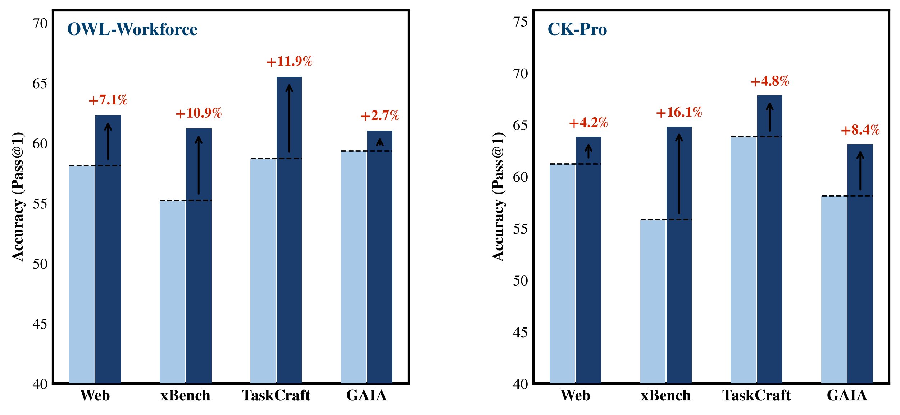</td>
</tr>
<tr>
<td><code>bar_spice</code></td>
<td>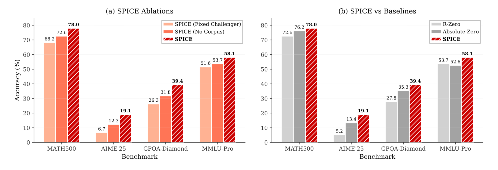</td>
<td>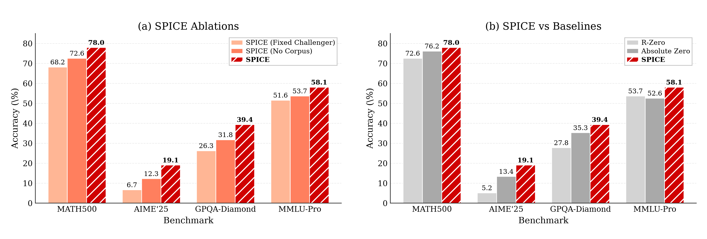</td>
</tr>
<tr>
<td><code>line_selfdistill_train</code></td>
<td>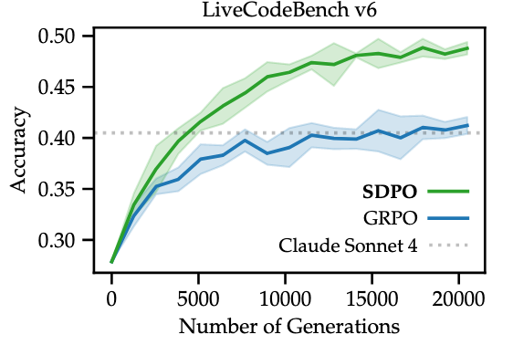</td>
<td>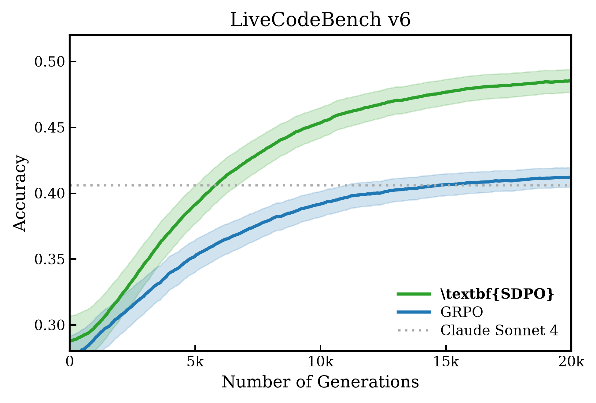</td>
</tr>
<tr>
<td><code>line_selfdistill_scale</code></td>
<td>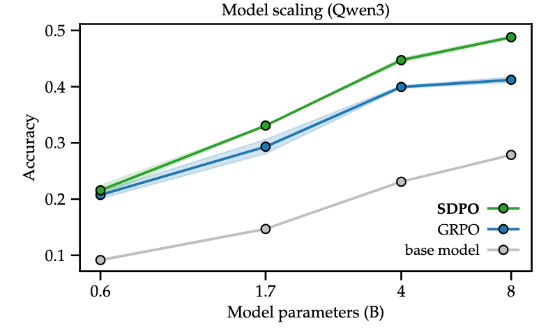</td>
<td>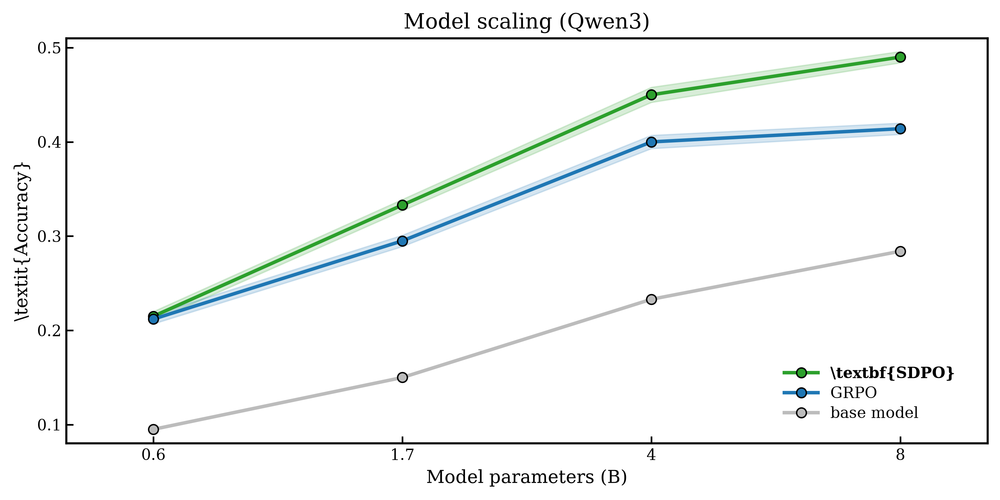</td>
</tr>
<tr>
<td><code>line_aime</code></td>
<td>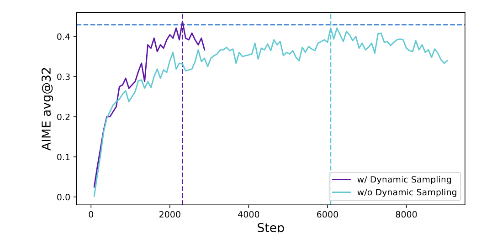</td>
<td>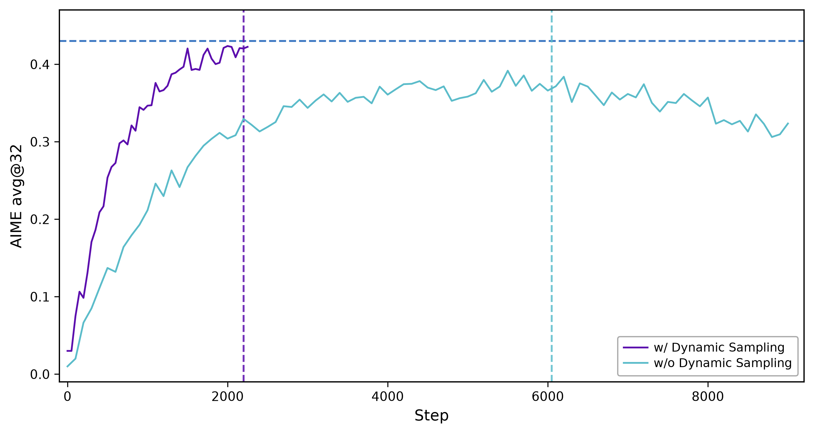</td>
</tr>
<tr>
<td><code>line_loss_inset</code></td>
<td>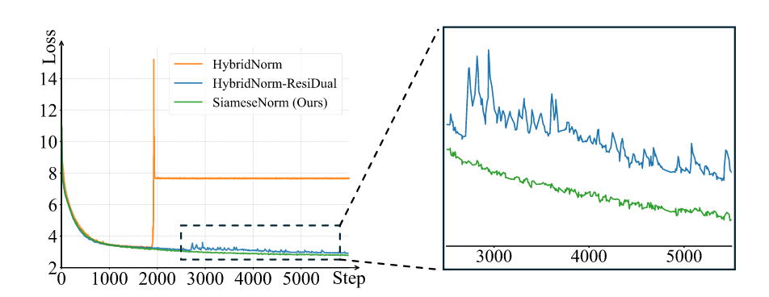</td>
<td>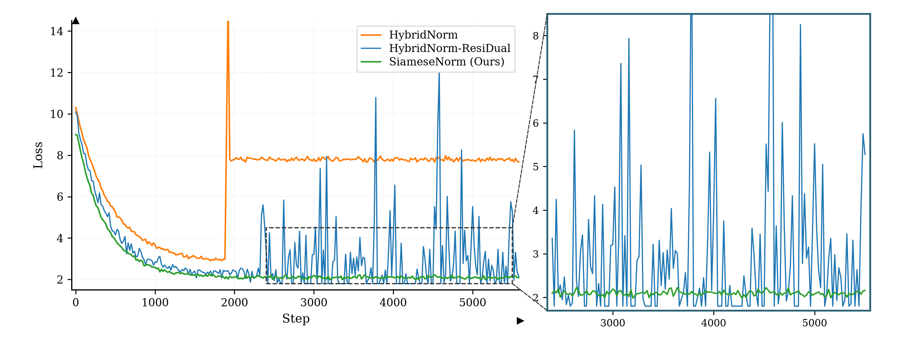</td>
</tr>
<tr>
<td><code>scatter_tsne</code></td>
<td>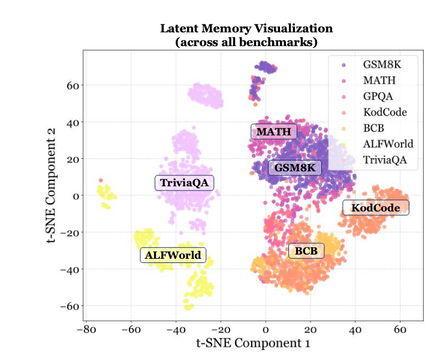</td>
<td>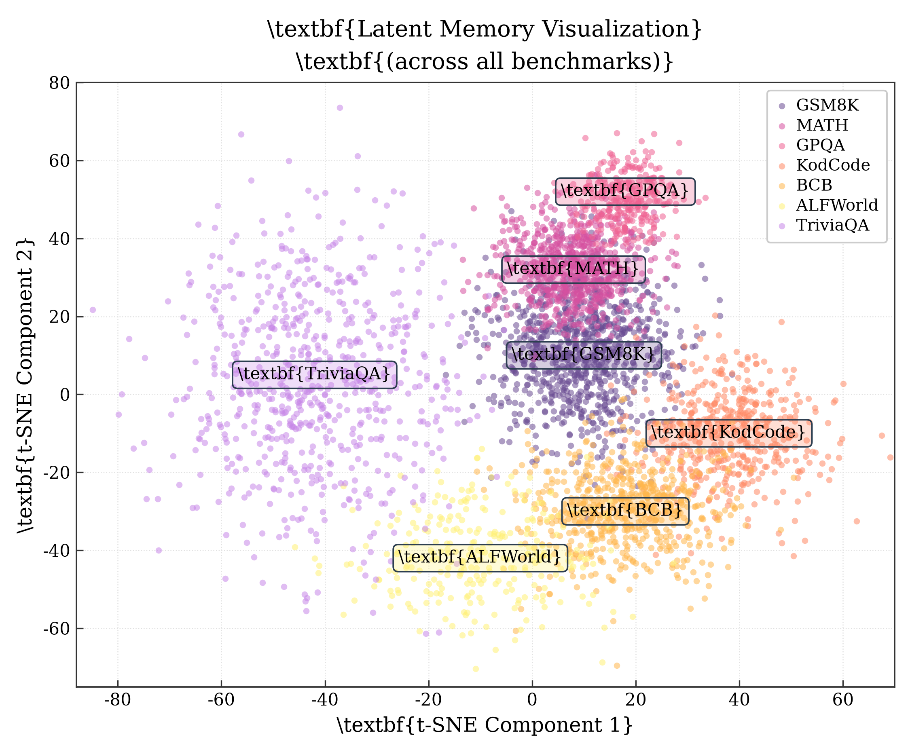</td>
</tr>
<tr>
<td><code>scatter_break</code></td>
<td>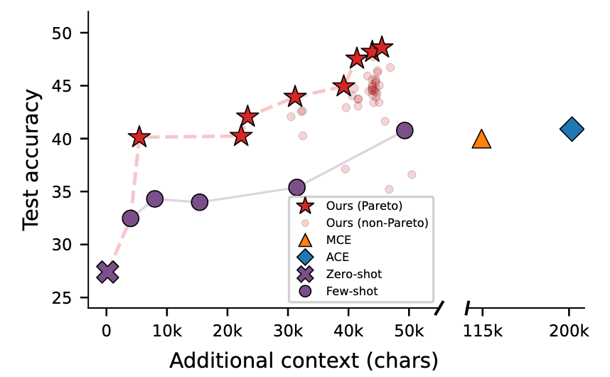</td>
<td>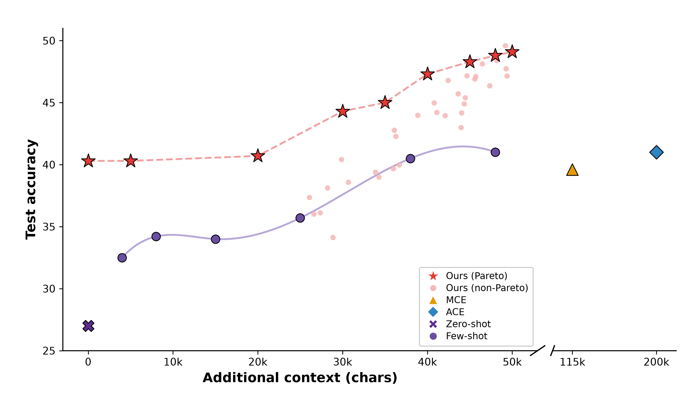</td>
</tr>
<tr>
<td><code>radar_dora</code></td>
<td>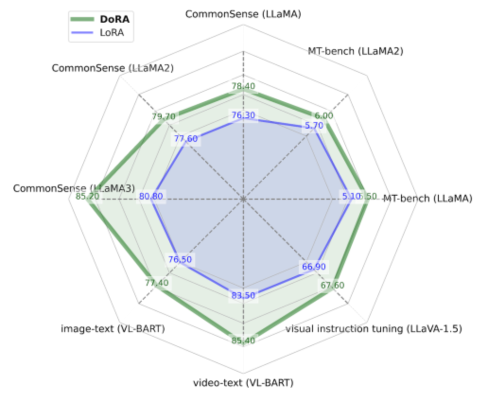</td>
<td>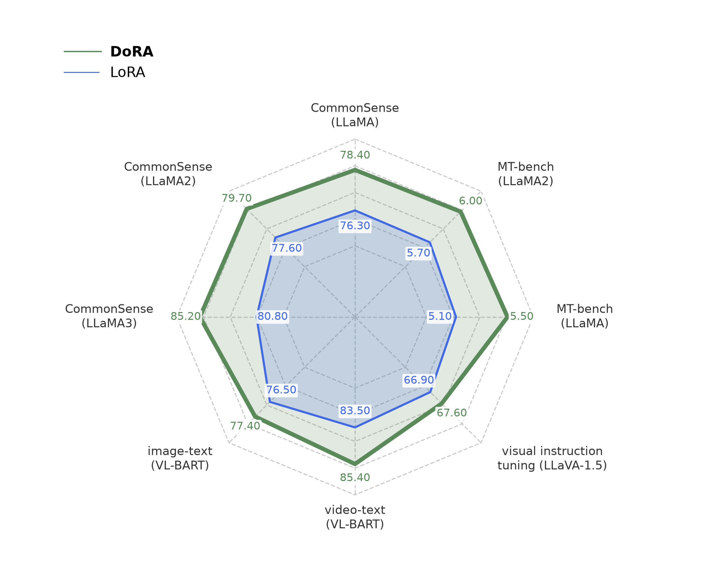</td>
</tr>
<tr>
<td><code>classwise_iou</code></td>
<td>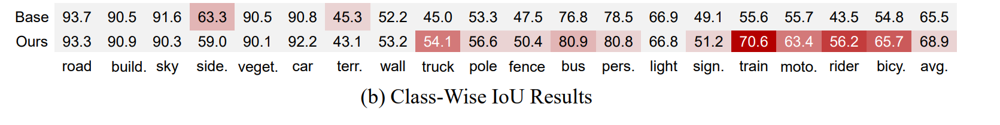</td>
<td>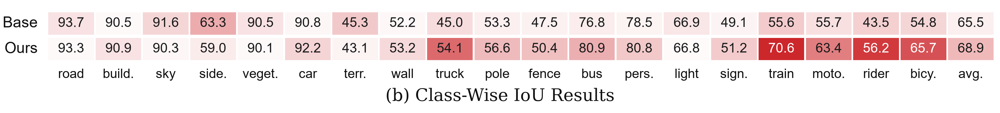</td>
</tr>
</table>

其中 `classwise_iou` 是直接走 `plot-from-image` 流程新增复现的案例：

> 输入图片：[`originals/classwise_iou.png`](originals/classwise_iou.png)  
> 复现脚本：[`plot-from-image/scripts/classwise_iou_table.py`](plot-from-image/scripts/classwise_iou_table.py)

---

## 风格图库 · Gallery

---

### 柱状图 Bar Charts

#### `bar_paired_delta` — 配对增益柱

> **来源**：MemEvolve: Meta-Evolution of Agent Memory Systems  
> serif 字体，配对柱（baseline vs method），箭头标注增益，Y 轴各子图独立  
> 参数文档：[`plot-from-data/references/bar_paired_delta.md`](plot-from-data/references/bar_paired_delta.md) · 脚本：[`plot-from-data/scripts/bar_memevolve.py`](plot-from-data/scripts/bar_memevolve.py)

<table><tr>
<td align="center"><b>原图</b></td>
<td align="center"><b>复现</b></td>
</tr><tr>
<td></td>
<td></td>
</tr></table>

---

#### `bar_grouped_hatch` — 分组斜线填充柱

> **来源**：SPICE: Self-Play In Corpus Environments  
> LaTeX serif，分组柱 + 主方法白色斜线填充，柱顶数值（最优加粗），开口 L 形 spine  
> 参数文档：[`plot-from-data/references/bar_grouped_hatch.md`](plot-from-data/references/bar_grouped_hatch.md) · 脚本：[`plot-from-data/scripts/bar_spice.py`](plot-from-data/scripts/bar_spice.py)

<table><tr>
<td align="center"><b>原图</b></td>
<td align="center"><b>复现</b></td>
</tr><tr>
<td></td>
<td></td>
</tr></table>

---

### 折线图 Line Charts

#### `line_confidence_band` — 置信区间训练曲线

> **来源**：Reinforcement Learning via Self-Distillation  
> LaTeX Computer Modern serif，EMA 平滑主线，浅色置信区间 `fill_between`，SDPO 加粗图例  
> 参数文档：[`plot-from-data/references/line_confidence_band.md`](plot-from-data/references/line_confidence_band.md) · 脚本：[`plot-from-data/scripts/line_selfdistill.py`](plot-from-data/scripts/line_selfdistill.py)

<table><tr>
<td align="center"><b>原图</b></td>
<td align="center"><b>复现</b></td>
</tr><tr>
<td></td>
<td></td>
</tr></table>

---

#### `line_training_curve` — 垂直断点 + 水平参考线

> **来源**：DAPO: An Open-Source LLM RL System at Scale  
> sans-serif，四边框，朝外刻度，水平参考线（独立蓝色），两条垂直断点虚线（与曲线同色）  
> 参数文档：[`plot-from-data/references/line_training_curve.md`](plot-from-data/references/line_training_curve.md) · 脚本：[`plot-from-data/scripts/line_aime.py`](plot-from-data/scripts/line_aime.py)

<table><tr>
<td align="center"><b>原图</b></td>
<td align="center"><b>复现</b></td>
</tr><tr>
<td></td>
<td></td>
</tr></table>

---

#### `line_loss_with_inset` — L 形 spine + 局部放大 inset

> **来源**：SiameseNorm: Breaking the Barrier to Reconciling Pre/Post-Norm  
> LaTeX serif，L 形 spine + 轴端箭头，虚线放大框，黑色虚线连接右侧独立 inset 子图  
> 参数文档：[`plot-from-data/references/line_loss_with_inset.md`](plot-from-data/references/line_loss_with_inset.md) · 脚本：[`plot-from-data/scripts/line_loss_inset.py`](plot-from-data/scripts/line_loss_inset.py)

<table><tr>
<td align="center"><b>原图</b></td>
<td align="center"><b>复现</b></td>
</tr><tr>
<td></td>
<td></td>
</tr></table>

---

### 散点图 Scatter Plots

#### `scatter_tsne_cluster` — t-SNE 聚类分布

> **来源**：MemGen: Weaving Generative Latent Memory for Self-Evolving Agents  
> LaTeX serif，7 类聚类，圆角注释框（统一深灰边 + 聚类色底），浅灰点线网格，四边框  
> 参数文档：[`plot-from-data/references/scatter_tsne_cluster.md`](plot-from-data/references/scatter_tsne_cluster.md) · 脚本：[`plot-from-data/scripts/scatter_tsne.py`](plot-from-data/scripts/scatter_tsne.py)

<table><tr>
<td align="center"><b>原图</b></td>
<td align="center"><b>复现</b></td>
</tr><tr>
<td></td>
<td></td>
</tr></table>

---

#### `scatter_broken_axis` — 折断 X 轴散点图

> **来源**：Meta-Harness: End-to-End Optimization of Model Harnesses  
> sans-serif 粗体标签，双面板折断 X 轴（0-50k | 115k/200k），多 marker（★ ○ △ ◆ × ○），折断符仅底边  
> 参数文档：[`plot-from-data/references/scatter_broken_axis.md`](plot-from-data/references/scatter_broken_axis.md) · 脚本：[`plot-from-data/scripts/scatter_break.py`](plot-from-data/scripts/scatter_break.py)

<table><tr>
<td align="center"><b>原图</b></td>
<td align="center"><b>复现</b></td>
</tr><tr>
<td></td>
<td></td>
</tr></table>

---

### 雷达图 Radar Chart

#### `radar_dual_series` — 双方法多维对比

> **来源**：DoRA: Weight-Decomposed Low-Rank Adaptation  
> sans-serif，正八边形虚线同心网格，DoRA 深绿粗线 vs LoRA 蓝色细线，数值标注白底，图例左上  
> 参数文档：[`plot-from-data/references/radar_dual_series.md`](plot-from-data/references/radar_dual_series.md) · 脚本：[`plot-from-data/scripts/radar_dora.py`](plot-from-data/scripts/radar_dora.py)

<table><tr>
<td align="center"><b>原图</b></td>
<td align="center"><b>复现</b></td>
</tr><tr>
<td></td>
<td></td>
</tr></table>

---

### `plot-from-image` 示例

#### `classwise_iou` — 类别级结果表

> **来源**：用户上传论文截图 https://github.com/Trae1ounG/paper-plot-skills/issues/1 \
> 纯表格式布局，双行结果 + 强弱高亮底色，按图片比例与文字排布直接复现  
> 输入图片：[`originals/classwise_iou.png`](originals/classwise_iou.png) · 脚本：[`plot-from-image/scripts/classwise_iou_table.py`](plot-from-image/scripts/classwise_iou_table.py)

<table><tr>
<td align="center"><b>原图</b></td>
<td align="center"><b>复现</b></td>
</tr><tr>
<td></td>
<td></td>
</tr></table>

## Star History

